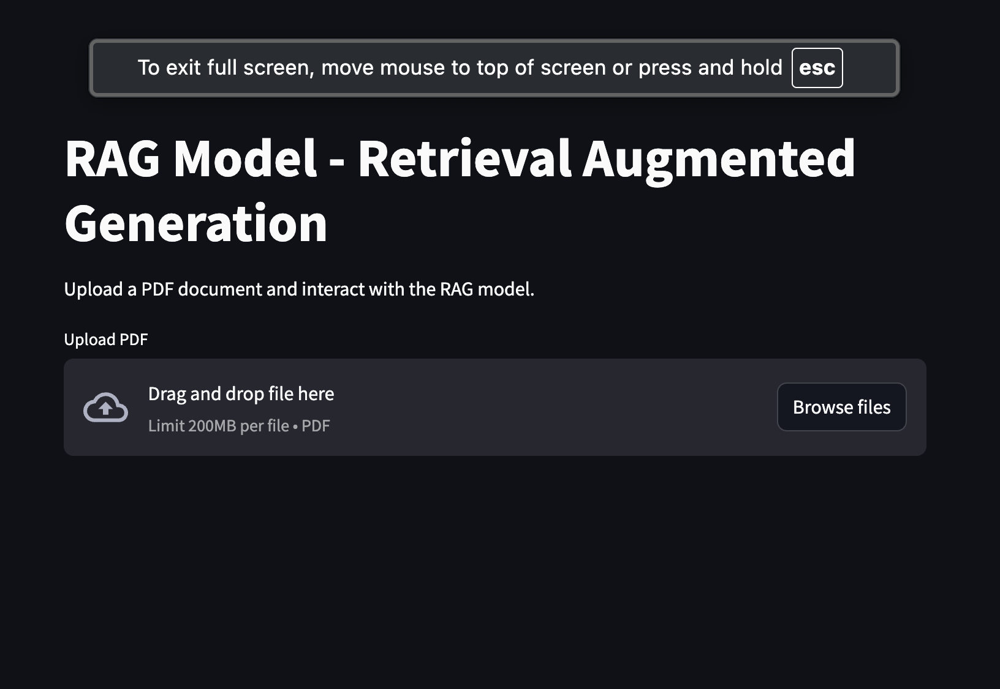

# RAG (Retrieval-Augmented Generation) Streamlit App

## Overview
This Streamlit app allows you to interact with a Retrieval-Augmented Generation (RAG) model. The app can process documents (PDF format) and answer questions based on the content of the document.


## Features
- **Document Upload**: Upload PDF documents for processing.
- **Text Splitting**: The document is split into manageable chunks for efficient querying.
- **Question Answering**: Ask questions about the content of the uploaded document, and get accurate responses powered by the RAG model.



## Requirements
- Python 3.x
- Streamlit
- LangChain
- OpenAI API key

## Setup
1. Clone this repository or download the code.
2. Install the required dependencies:
   ```bash
   pip install -r requirements.txt
   ```
3. Set up your `.env` file with the OpenAI API key:
   ```
   OPENAI_API_KEY=<your-openai-api-key>
   ```
4. Run the Streamlit app:
   ```bash
   streamlit run app.py
   ```

## Usage
1. Upload a PDF document through the interface.
2. Ask a question related to the document.
3. The model will process the document and return an answer based on the content.

## License
This project is licensed under the MIT License.
